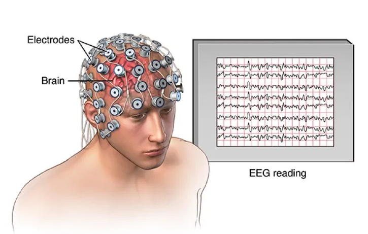

# 🧠 EEG-Based Mental Workload Classification

### Machine Learning for EEG Signal Analysis and Cognitive Workload Assessment

[](https://www.python.org/)
[](#)
[](#)
[](https://scikit-learn.org/)
[](https://mne.tools/)

---

## 📌 Overview

This project presents a **machine-learning approach for classifying mental workload from EEG (Electroencephalography) signals**.

The system processes EEG recordings, extracts frequency-domain features from multiple EEG channels, selects the most informative features, and trains a Support Vector Machine (SVM) classifier to distinguish between different levels of mental workload.

The project also integrates the trained machine-learning model into a **graphical user interface (GUI)** that allows users to process EEG data and obtain workload predictions.

The predicted workload levels are represented as:

- 🟢 **Low**
- 🟡 **Medium**
- 🔴 **High**

The repository therefore combines:

**EEG Signal Processing + Feature Engineering + Machine Learning + Model Evaluation + GUI Application**

---

# 🎯 Project Objective

The main objective of this project is:

> **To investigate whether EEG signal characteristics can be used to automatically classify different levels of mental workload using machine learning.**

The project follows a complete machine-learning pipeline from raw EEG data to an application-level prediction.

---

# 🧠 What is Mental Workload?

Mental workload describes the amount of cognitive effort required to perform a task.

Understanding mental workload is important in areas such as:

- Human–Computer Interaction
- Brain–Computer Interfaces
- Neuroergonomics
- Cognitive-state monitoring
- Adaptive interfaces
- Human–AI interaction
- Safety-critical systems

EEG provides a non-invasive way of recording electrical brain activity. This project investigates whether patterns within EEG signals can provide useful information for distinguishing different workload levels.

---

# 🔬 Methodology

The project follows the following pipeline:

```text
                  EEG Dataset
                       │
                       ▼
              EEG Data Loading
                       │
                       ▼
              Data Standardisation
                       │
                       ▼
           Frequency-Domain Analysis
                       │
                       ▼
              Band-Power Features
                       │
        ┌──────────────┼──────────────┐
        ▼              ▼              ▼
      Delta          Theta          Alpha
        │              │              │
        └──────────────┼──────────────┘
                       │
                 Beta + Gamma
                       │
                       ▼
               Feature Selection
                 SelectKBest
                       │
                       ▼
               SVM Classification
                       │
                       ▼
          Leave-One-Group-Out Testing
                       │
                       ▼
            Mental Workload Prediction
                       │
                       ▼
                 GUI Application
```

# 📊 EEG Data Processing

The training pipeline processes EEG recordings stored in MATLAB `.mat` files.

The implementation loads the cleaned EEG data and associated labels from the dataset structure.

The preprocessing pipeline includes:

1. Loading EEG recordings
2. Extracting cleaned EEG data
3. Extracting workload labels
4. Standardising the EEG signals
5. Encoding categorical labels
6. Extracting frequency-domain features

The current implementation uses a **128 Hz sampling frequency**.

---

# 🧠 EEG Frequency Bands

The project extracts EEG power information from five frequency bands:

| Frequency Band | Frequency Range |
|---|---|
| Delta | 1–4 Hz |
| Theta | 4–8 Hz |
| Alpha | 8–13 Hz |
| Beta | 13–30 Hz |
| Gamma | 30–45 Hz |

These features are calculated using **Welch's power spectral density estimation** through **MNE-Python**.

The frequency-domain features are calculated for the EEG channels and then transformed into a machine-learning feature representation.

---

# 📡 EEG Channels

The implementation works with **14 EEG channels**.

For each channel, the system extracts power features from:

- Delta
- Theta
- Alpha
- Beta
- Gamma

This produces a multi-dimensional representation of the EEG signal that can be used by the machine-learning model.

# 🧪 Feature Engineering

Feature engineering is a major component of the project.

The pipeline is:

```text
EEG Signal
     │
     ▼
Standardisation
     │
     ▼
Power Spectral Density
     │
     ▼
Frequency Band Power
     │
     ▼
Feature Matrix
     │
     ▼
Feature Selection
```
The project uses **SelectKBest** with an **ANOVA F-statistic (`f_classif`)** to select the most informative features.

The current implementation selects the **top 100 features** from the available feature set.

# 🤖 Machine Learning Model

The main classifier implemented in the training pipeline is a:

## Support Vector Machine (SVM)

The model uses:

```text
StandardScaler
      +
SVM
      │
      └── Polynomial Kernel
```
The classifier is implemented using sklearn.svm.SVC with:
```python
SVC(
    kernel='poly',
    decision_function_shape='ovr'
)
```
The model is combined with StandardScaler inside a scikit-learn Pipeline.

# 🔄 Model Evaluation

Because EEG data can vary considerably between individuals, evaluating performance across subjects is particularly important.

The project uses:

## Leave-One-Group-Out Cross-Validation

Subjects are treated as groups during evaluation.

In each iteration:

```text
Multiple Subjects
       │
       ▼
Training Data
       │
       ▼
SVM
       │
       ▼
Held-Out Subject
       │
       ▼
Prediction
       │
       ▼
Accuracy
```
The implementation calculates an accuracy score for each held-out subject and then calculates the average accuracy across the evaluation process.

This evaluation strategy helps test whether the model can generalise across different subjects rather than only learning patterns from the same individuals used during training.

# 💾 Trained Model

After training, the SVM pipeline is saved using Python's **pickle** functionality.

The trained model is saved as:

```text
models/svm_loso.pkl
```
This allows the trained classifier to be integrated into the application rather than retraining the model every time the application is used.

🖥️ Application

The project includes a graphical user interface designed to make the machine-learning system accessible through an application rather than requiring users to interact directly with the training code.

The GUI is implemented using Tkinter / CustomTkinter and integrates the EEG processing and prediction functionality.

The application includes functionality for:

User login
EEG data processing
Mental workload prediction
Prediction visualisation
Prediction history
Session management
Local database interaction
📈 Workload Prediction

The application converts the model's numerical prediction into an interpretable workload level:
```text
Prediction
    │
    ├── 0 → LOW
    │
    ├── 1 → MEDIUM
    │
    └── 2 → HIGH
```
The application also includes a visual gauge representing the predicted workload level.

This makes the machine-learning output easier for a user to interpret.

# 🗂️ Prediction History

The application includes functionality for storing and retrieving prediction history.

The project uses **SQLite** for local data storage.

The database structure includes information related to:

- Users
- Sessions
- Subjects
- Predictions
- Prediction timestamps

The history functionality allows predictions to be associated with the logged-in user and retrieved later.
# 🏗️ System Architecture

The overall system can be represented as:

```text
                    ┌──────────────────┐
                    │    EEG Dataset   │
                    └────────┬─────────┘
                             │
                             ▼
                    ┌──────────────────┐
                    │ Data Processing  │
                    │ & Standardisation│
                    └────────┬─────────┘
                             │
                             ▼
                    ┌──────────────────┐
                    │ Feature          │
                    │ Extraction       │
                    │                  │
                    │ Delta            │
                    │ Theta            │
                    │ Alpha            │
                    │ Beta             │
                    │ Gamma            │
                    └────────┬─────────┘
                             │
                             ▼
                    ┌──────────────────┐
                    │ Feature          │
                    │ Selection        │
                    │ SelectKBest      │
                    └────────┬─────────┘
                             │
                             ▼
                    ┌──────────────────┐
                    │ SVM Classifier   │
                    │ Polynomial Kernel│
                    └────────┬─────────┘
                             │
                             ▼
                    ┌──────────────────┐
                    │ Workload         │
                    │ Prediction       │
                    └────────┬─────────┘
                             │
                             ▼
              ┌──────────────────────────────┐
              │        GUI Application       │
              │                              │
              │   Low / Medium / High        │
              │                              │
              │   Prediction History         │
              └──────────────────────────────┘
```

# 📁 Repository Structure

```text
EEG-Based-Mental-Workload-Classification/
│
├── assets/
│   └── Application assets and interface resources
│
├── models/
│   └── Trained machine-learning models
│
├── db.py
│   └── SQLite database functionality
│
├── gui.py
│   └── Main GUI functionality
│
├── history.py
│   └── Prediction history functionality
│
├── home.py
│   └── Application home interface
│
├── main.py
│   └── Application entry point
│
├── model.py
│   └── EEG preprocessing and prediction functionality
│
├── nav.py
│   └── Application navigation
│
├── training.py
│   └── EEG processing, feature extraction and model training
│
├── icon.ico
│   └── Application icon
│
├── .gitignore
├── .gitattributes
└── README.md
```

# 🛠️ Technologies & Libraries

## Programming

- Python

## EEG & Signal Processing

- MNE-Python
- NumPy
- SciPy
- Welch Power Spectral Density

## Machine Learning

- Scikit-learn
- Support Vector Machines
- StandardScaler
- SelectKBest
- ANOVA F-statistics
- Leave-One-Group-Out cross-validation

## Data Processing

- Pandas
- NumPy
- MATLAB `.mat` file processing

## Application Development

- Tkinter
- CustomTkinter
- Pillow
- SQLite
- Matplotlib

## Model Persistence

- Pickle
- Joblib

# 🚀 Installation

### 1. Clone the Repository

```bash
git clone https://github.com/zeinabdastmozd/EEG-Based-Mental-Workload-Classification.git
```
```bash
cd EEG-Based-Mental-Workload-Classification
```
## 2. Create a Virtual Environment

### Windows

```bash
python -m venv venv
venv\Scripts\activate
```
### macOS / Linux
```bash
python3 -m venv venv
source venv/bin/activate
```
## 3. Install the Required Packages

The training pipeline uses packages including:

```bash
pip install numpy pandas scipy scikit-learn matplotlib mne nolds pillow joblib customtkinter imageio
```
The project currently contains package-installation logic inside the training script. For a cleaner and more reproducible project, a requirements.txt file is recommended.

# 📂 Dataset

The training pipeline expects the EEG dataset to be organised in a directory named:

```text
dataset nBack/
```
The code searches through subject directories and processes MATLAB .mat files containing the cleaned EEG recordings.

The training script specifically looks for files containing:
```text
Session_1
```
and ending in:
```text
.mat
```
The dataset itself is not documented here as being redistributed by this repository. If the dataset has access or licensing restrictions, obtain it from its original source rather than uploading restricted participant data to GitHub.
# ▶️ Training the Model

After placing the dataset in the expected directory structure, run:

```bash
python training.py
```
The training workflow performs:

1. Dataset loading
2. EEG standardisation
3. Label encoding
4. Frequency-domain feature extraction
5. Feature selection
6. Subject-grouped model evaluation
7. SVM training
8. Model saving

The trained model is saved to:

```text
models/svm_loso.pkl
```
# 🖥️ Running the Application

The main application entry point is:

```bash
python main.py
```
The application provides the user-facing interface for interacting with the trained model.

If your local environment requires a different startup command, update this section to match your final application configuration.
# 📊 Results

The training pipeline reports:

- Accuracy for each held-out subject
- Average accuracy across subjects

The results are printed during model training.

Example output format:

```text
Subject X - Accuracy: 0.xxx
Subject Y - Accuracy: 0.xxx
...
Average accuracy: 0.xxx
```
### Model Performance

| Evaluation | Result |
|---|---|
| Leave-One-Group-Out | See training output |
| Average Accuracy | See training output |

> **No performance value is hard-coded in this README because the repository should report the actual result produced by the current training run.**

This keeps the documentation reproducible and avoids reporting an unsupported performance figure.

---

# 📌 Key Technical Features

### EEG Processing

- 14-channel EEG processing
- 128 Hz sampling frequency
- Signal standardisation
- MATLAB `.mat` data loading

### Feature Engineering

- Welch power spectral density
- Delta power
- Theta power
- Alpha power
- Beta power
- Gamma power
- Feature selection using SelectKBest

### Machine Learning

- Support Vector Machine
- Polynomial kernel
- StandardScaler
- Leave-One-Group-Out evaluation
- Subject-level evaluation

### Application

- Graphical user interface
- Workload gauge
- Low / Medium / High classification
- User authentication
- Prediction history
- SQLite database

---

# 💡 Potential Applications

EEG-based mental workload classification is relevant to research areas including:

### 🧑‍💻 Human–Computer Interaction

Interfaces could potentially adapt to changes in a user's cognitive workload.

### 🧠 Brain–Computer Interfaces

Mental workload classification is relevant to passive BCI research.

### 🚗 Transportation

Workload estimation could contribute to research into driver monitoring and adaptive interfaces.

### 🏭 Safety-Critical Work

Mental workload monitoring may be relevant to environments where excessive cognitive demand could affect performance.

### 🤖 Adaptive AI

Future systems could potentially adapt their behaviour according to estimated cognitive workload.

> These represent potential research applications and are not claims that the current implementation has been validated for these real-world applications.

---

# ⚠️ Limitations & Considerations

EEG-based machine-learning systems face several challenges.

Important considerations include:

- EEG signals are susceptible to noise and artefacts
- EEG characteristics vary substantially between individuals
- Model performance may vary across subjects
- Generalisation to unseen users is an important challenge
- Feature selection and model parameters can affect performance
- The current implementation evaluates subjects using grouped cross-validation
- Real-world deployment would require additional validation

Therefore, model performance should be interpreted in the context of the experimental dataset and evaluation methodology.

---

# 🔐 Privacy & Security

EEG data can be sensitive, particularly when associated with identifiable participants.

This project should not expose:

- Participant-identifying information
- Private EEG recordings
- Passwords
- Authentication credentials
- Sensitive user information

Only data that can legally and ethically be shared should be included in the public repository.
# 🔬 Research Significance

This project demonstrates an end-to-end application of machine learning to physiological signals.

Rather than focusing only on model training, the project integrates:

```text
EEG Signal Processing
        +
Feature Engineering
        +
Feature Selection
        +
Machine Learning
        +
Cross-Subject Evaluation
        +
Application Development
```
This provides a practical example of how an EEG-based machine-learning model can be taken from signal processing and feature extraction through to an interactive application.
# 📚 Academic Context

This project was developed as an academic machine-learning project focusing on:

- EEG signal analysis
- Mental workload classification
- Machine learning
- Feature engineering
- Human–Computer Interaction
- Brain–Computer Interfaces

---

# 👩‍💻 Author

## Zeinab Dast Mozd

**MSc Artificial Intelligence | AI & Machine Learning Researcher**

### Research Interests

- Artificial Intelligence
- Machine Learning
- Natural Language Processing
- Large Language Models
- EEG & Brain–Computer Interfaces
- Human–AI Interaction
- AI Evaluation
- Responsible AI

---

# 📌 Project Status

**Academic Machine Learning Project**

The repository contains the implementation of an EEG-based mental workload classification system, including EEG processing, feature extraction, machine-learning training, model evaluation, trained-model integration, and a graphical user interface.

---

## ⭐ Research & Collaboration

Thank you for exploring this project.

For academic discussion, collaboration, or questions about the implementation, please feel free to connect with me through my professional profile.

  
